# Federated Learning System - Step-by-Step Guide

This README provides a visual walkthrough of the federated learning training and aggregation loop between a cloud server and Jetson client devices.

## Step 1: Clone Repository and Set Up Environment
Clone the federated learning repository and set up the Python virtual environment. Then install all required dependencies using `pip`:
```bash
# Clone the repository
git clone https://github.com/your-repo/federated-learning.git
cd federated-learning

# Create and activate virtual environment
python3 -m venv venv
source venv/bin/activate

# Install required packages
pip install -r requirements.txt
```
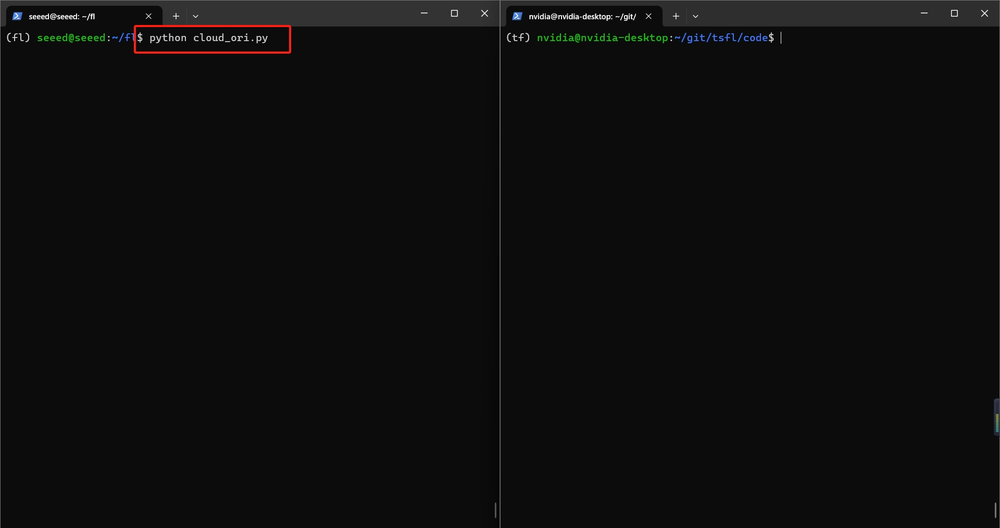

## Start the Client Training Script
Each Jetson client must run the training script to listen for instructions from the cloud, load local data, and begin training when prompted:
```bash
python train_ori.py
```
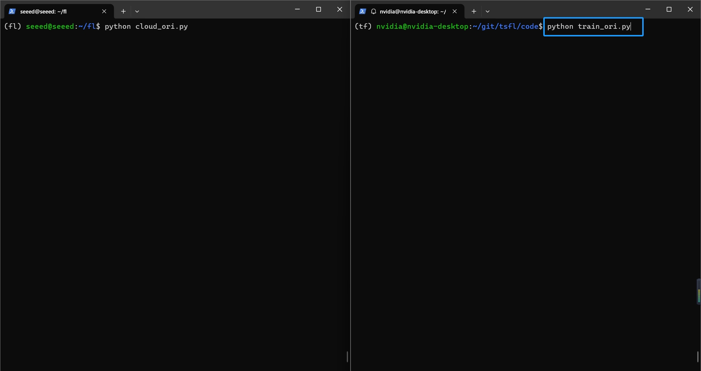

Cloud Waits for Upload
Once instructions are sent, the cloud server enters a wait loop until it receives the `.h5` model files and `.txt` logs from the clients.
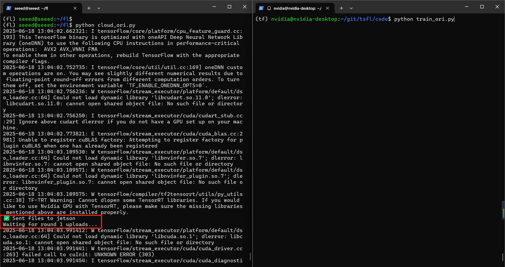

Jetson Begins Training
Each Jetson device reads the instruction file, identifies its dataset (like js11), loads local training data, and starts training the model accordingly.


Training Progress
As the model trains on Jetson, the terminal displays progress bars along with real-time updates for loss and accuracy on each epoch.
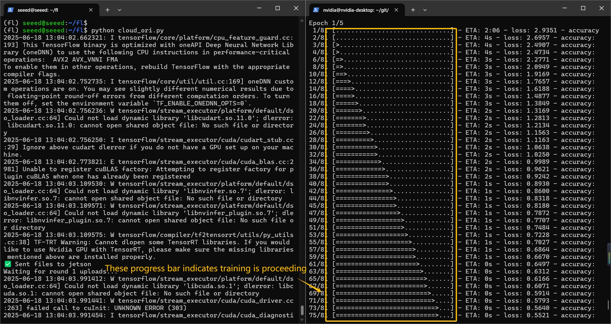

Upload to Cloud
After training, the Jetson uploads the trained model (`.h5`) and corresponding log file (`.txt`) to the server via SCP, awaiting confirmation.
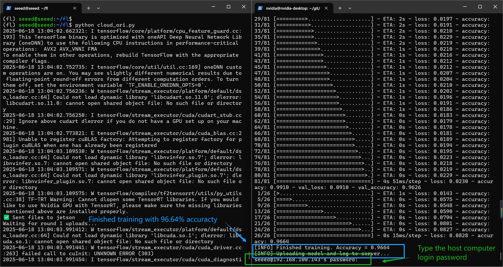

Cloud Issues Next Instruction
When all expected uploads are complete, the server aggregates the models and broadcasts the next round’s instruction with new datasets.
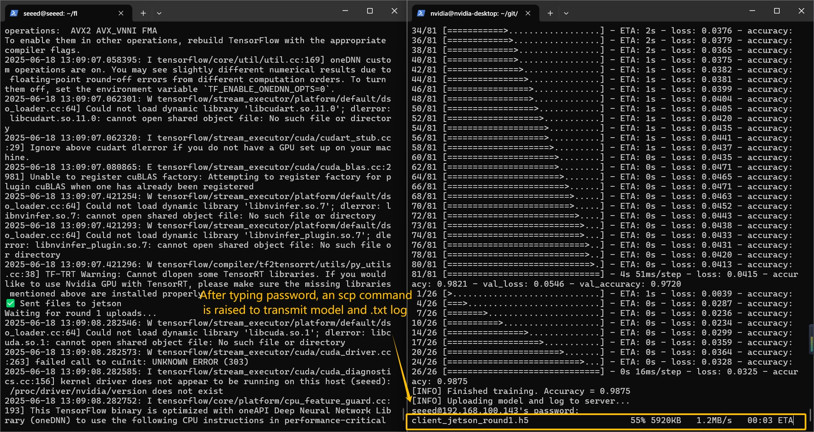

Training New Round
Clients receive the new instruction and start training again, now using new datasets such as js12 or js22 to continue local learning.
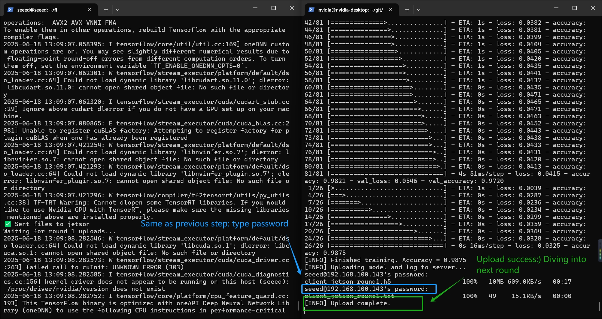

Repeating the Cycle
This process repeats automatically across multiple rounds, synchronizing model weights after each upload and progressing toward convergence.
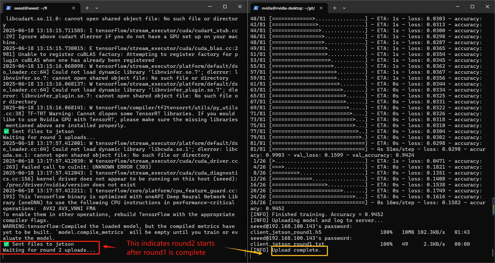

## Prediction Results

The following figures show model predictions after each federated training round. Green text indicates correct predictions. Red text indicates wrong predictions. Gray-shaded samples belong to the class trained in the current round.

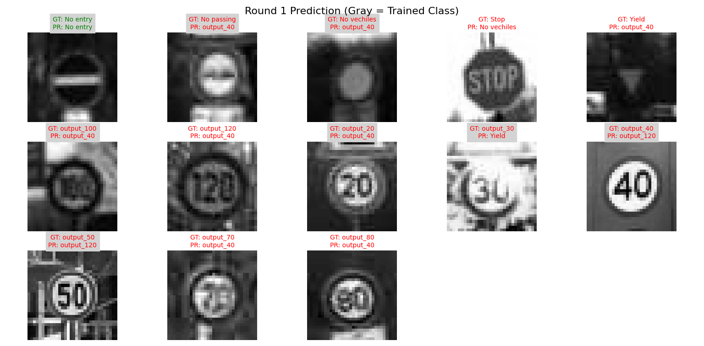
**Round 1:** Most predictions are incorrect (in red), especially for classes unseen in this round. Only trained classes (grayscale) show stable performance.

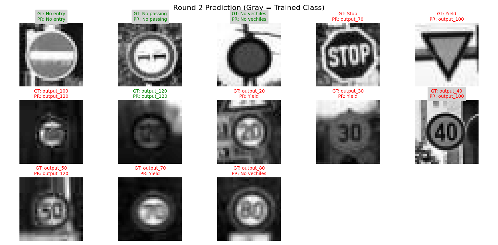
**Round 2:** Prediction accuracy improves slightly. Some classes still confuse the model, but correctly classified samples (green) start to appear.

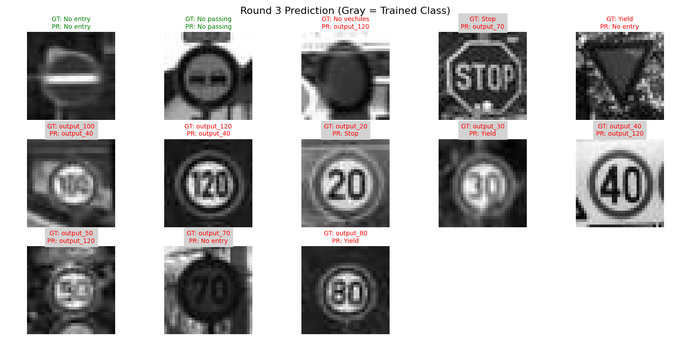
**Round 3:** Model generalization improves across all classes. More correct predictions appear, especially for newly trained classes shown in gray.
