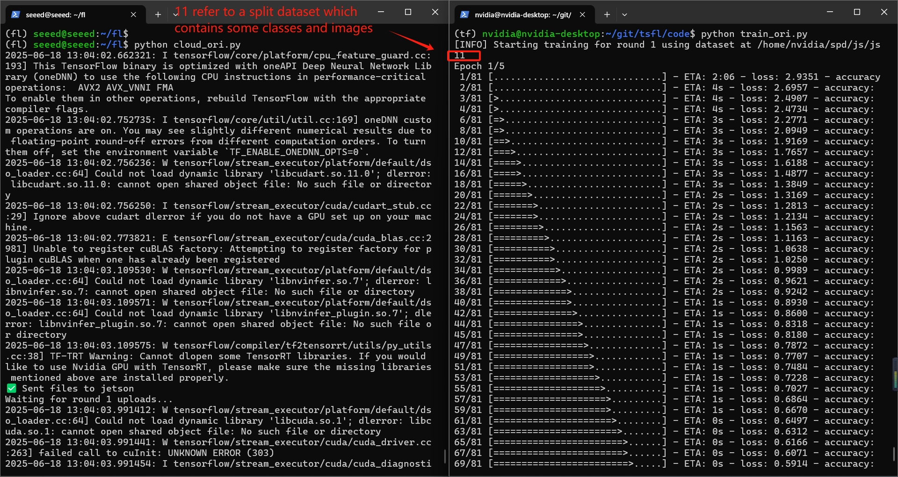

# Federated Learning System - Step-by-Step Guide

This README provides a visual walkthrough of the federated learning training and aggregation loop between a cloud server and Jetson client devices.

## Introduction

This project presents a streamlined Federated Learning (FL) orchestration framework, designed to coordinate distributed model training across edge devices, specifically NVIDIA Jetson platforms. [1] In this setup, a centralized **cloud node** serves as the global controller, tasked with issuing training instructions, monitoring client activity, collecting model updates, and aggregating them into a unified global model.

The cloud component functions as the core of the federated learning pipeline. It ensures synchronized participation across multiple heterogeneous clients by managing training rounds and maintaining control over the sequence of dataset assignments. Each Jetson client operates on locally stored data, performs model training, and uploads the trained model and associated logs back to the cloud. The cloud waits until all expected client models are received before proceeding with the next round of global aggregation and instruction dissemination.

This project focuses on a **file-based communication protocol**, where clients and the cloud exchange `.h5` model files and `.txt` logs using secure copy (SCP) commands. This approach offers simplicity and transparency for debugging and monitoring, making it suitable for educational and prototyping scenarios.

Overall, this system simulates a practical federated setup with emphasis on **synchronization, modularity**, and **lightweight coordination**, making it a valuable starting point for researchers and developers exploring edge-based AI deployment.

## Background

In traditional machine learning, large volumes of raw data are transmitted from distributed endpoints to a centralized data center for training. While this model has powered significant advancements, it raises serious concerns regarding **privacy**, **data ownership**, **communication overhead**, and **system scalability**. These issues are particularly prominent in domains like healthcare, autonomous vehicles, and smart surveillance, where data is sensitive and bandwidth is limited.

**Federated Learning (FL)** offers a paradigm shift by enabling model training directly at the data source. Instead of collecting raw data centrally, clients compute local updates and share only model parameters or gradients. This preserves data privacy, reduces network load, and allows real-time training in distributed environments.

However, implementing FL in real-world edge scenarios comes with challenges such as device heterogeneity, variable training speeds, and communication reliability. This project addresses these concerns by simulating a **synchronous FL architecture** with multiple Jetson devices and a central cloud controller. By managing instructions, training rounds, and aggregation cycles via lightweight scripting and SCP-based transfer, the system demonstrates a practical balance between functionality and simplicity.

This work is especially relevant for **resource-constrained deployments**, such as smart city infrastructures, where edge devices collaboratively learn without compromising performance or privacy.

## Methodology

The overall architecture consists of a centralized **cloud node** and several **Jetson-based edge clients**. 

The **cloud node** acts as the orchestrator, issuing training instructions, monitoring client progress, collecting model updates, and performing aggregation to generate global models. This node operates in a looped routine across multiple training rounds.

Each **Jetson client** functions as an autonomous training unit. It receives instructions from the cloud, loads a specified local dataset, and performs training using the latest global model as its initialization.  
**The model architecture used for training is MiniVGGNet**, a lightweight convolutional neural network optimized for efficient image classification on embedded hardware. [2] Once training concludes, the client uploads the updated model and a log file summarizing its results.

**Communication** between the cloud and clients is facilitated through secure **SCP (Secure Copy Protocol)**. This ensures that model files and logs are safely transferred without requiring complex networking setups.  
All communication is handled through monitored directories, simplifying the orchestration process.

The **instruction logic** on the cloud side is event-driven.  
The system continuously scans a designated `receive/` folder for uploaded model updates.  
When all expected uploads for a given round are present, the cloud automatically triggers the aggregation process and proceeds to the next round.


The Functional Block Diagram illustrates the logical flow of the federated learning process. The cloud node coordinates the process by distributing training instructions to multiple Jetson clients. Each client performs local training and sends model updates along with training logs back to the cloud. The cloud then performs aggregation (e.g., FedAvg) to generate a new global model. [3] This process iterates over several rounds to improve performance without centralized data collection.


The System Block Diagram presents the physical setup of the federated learning architecture. A cloud server communicates securely with multiple Jetson edge devices via SSH/SCP over a network switch. Each Jetson board is connected to a local monitor and runs independently during training. This diagram emphasizes hardware layout and communication pathways in the deployment environment.


### Workflow

Each training round begins with the cloud writing a simple instruction file in the `log/` directory. This file specifies which subsets of data (e.g., `js11`, `js21`) each Jetson should use in the current round.

Upon detecting the instruction, Jetson clients parse it to determine their assignment. Each client loads its corresponding dataset and initializes a local model, typically using the latest global weights. Training is then conducted locally on the Jetson, producing a refined model tailored to that data subset.

Once training completes, the Jetson saves both the trained `.h5` model file and a `.txt` log summarizing the round’s performance. These are securely uploaded to the cloud's `receive/` folder.

The cloud enters a blocking state, monitoring the `receive/` directory. When all expected clients have uploaded their files, the cloud proceeds to perform model aggregation.

After aggregation, the updated global model is saved (e.g., `global_round2.h5`) and a new instruction is written. This initiates the next round of the federated learning process, repeating the cycle.

### Model Aggregation

The core of the federated learning loop is the model aggregation step. Once all client models for a round have been uploaded, the cloud loads each `.h5` model file, extracts the neural network weights, and computes the average for each corresponding layer.

This process implements a simple **Federated Averaging (FedAvg)** algorithm, which assumes equal weighting across clients for simplicity. The resulting aggregated model is then saved as `global_roundX.h5`, where `X` corresponds to the current round. This model is subsequently redistributed to the clients for the next iteration of training, completing the feedback loop.

## Repository Structure

The `traffic_sign_fl` project is organized into the following directories:

### `/code/`
Contains all source code for both the cloud server and Jetson clients. It includes scripts for training, inference, orchestration, and model definition.

- `cloud.py`: Coordinates training rounds and aggregates models.
- `train_single.py`: Performs local training on Jetson devices.
- `predict_single.py`: Visualizes predictions using trained models.
- `utils.py`: Utility functions shared across modules.
- `cnn_model.py`: Defines the MiniVGGNet model architecture.

### `/dset/`
Holds the traffic sign image dataset, partitioned into subsets for different clients.

- `js11/`, `js12/`, ..., `js23/`: Local datasets assigned to each Jetson for training in a specific round.
- `full/`: The entire dataset used for pretraining or evaluation.

### `/figs/`
Contains visual results and documentation images.

- `1.png`, `2.png`, `3.png`: Prediction result visualizations after each federated round.
- `ins*.png`: Instructional screenshots used in the README documentation.

### `/model/`
Stores the initial pretrained model and aggregated models after each round.

- `initial_model.h5`: The MiniVGGNet model trained on the full dataset.
- `global_roundX.h5`: Aggregated global model after round X.

### `/log/`
Used for temporary storage of log files transferred from Jetson clients.

- `init_train_jetson.txt`: Initial training logs.
- `global_roundX_jetson.txt`: Log files corresponding to each training round and client.

### Root Files
- `README.md`: Main documentation file.
- `requirements.txt`: Lists Python package dependencies for installation.

## Usage Instructions

## Step 1: Clone Repository and Set Up Environment
Clone the federated learning repository and set up the Python virtual environment. Then install all required dependencies using `pip`:
```bash
# Clone the repository
git clone https://github.com/your-repo/federated-learning.git
cd federated-learning

# Create and activate virtual environment
python3 -m venv venv
source venv/bin/activate

# Install required packages
pip install -r requirements.txt
```


## Start the Client Training Script
Each Jetson client must run the training script to listen for instructions from the cloud, load local data, and begin training when prompted:
```bash
python train_ori.py
```


Cloud Waits for Upload
Once instructions are sent, the cloud server enters a wait loop until it receives the `.h5` model files and `.txt` logs from the clients.


Jetson Begins Training
Each Jetson device reads the instruction file, identifies its dataset (like js11), loads local training data, and starts training the model accordingly.


Training Progress
As the model trains on Jetson, the terminal displays progress bars along with real-time updates for loss and accuracy on each epoch.


Upload to Cloud
After training, the Jetson uploads the trained model (`.h5`) and corresponding log file (`.txt`) to the server via SCP, awaiting confirmation.


Cloud Issues Next Instruction
When all expected uploads are complete, the server aggregates the models and broadcasts the next round’s instruction with new datasets.


Training New Round
Clients receive the new instruction and start training again, now using new datasets such as js12 or js22 to continue local learning.


Repeating the Cycle
This process repeats automatically across multiple rounds, synchronizing model weights after each upload and progressing toward convergence.


Once all three rounds are completed, you will find the global model files for each round under /tsfl/log. This indicates that the entire training process has finished.

## Prediction Results

In the prediction results section, this script loads models from each round, selects one random image per class, and visualizes predictions. Correct predictions are marked in green, incorrect in red, and classes trained in the current round are shown with a gray background. This highlights model accuracy and coverage.

The following figures show model predictions after each federated training round. Green text indicates correct predictions. Red text indicates wrong predictions. Gray-shaded samples belong to the class trained in the current round.


**Round 1:** In the first round, the model is only trained on a limited subset of classes, which is reflected in the poor performance across most predictions. The majority of outputs are incorrect, particularly for signs that were not part of the training set. The few gray-shaded signs (trained classes) exhibit correct predictions, demonstrating the model’s ability to learn from local training. However, there is little generalization beyond trained categories, indicating the initial round has not provided enough shared knowledge for broader accuracy.


**Round 2:** After the second round of federated training, noticeable improvements appear. Several signs are correctly predicted (marked in green), and more confident predictions are visible even for classes outside the training subset. This suggests that aggregated knowledge from multiple clients is enabling the model to generalize better. Misclassifications still occur, but the model shows stronger consistency with both previously seen and new classes, indicating effective parameter fusion during aggregation.


**Round 3:** By round three, the model demonstrates improved generalization and accuracy. Correct predictions become more frequent and are distributed across a wider range of classes, including those not initially trained. The trained classes for this round (gray) show strong recognition, while even untrained classes benefit from the accumulated shared knowledge. The improvements indicate that federated aggregation is successfully building a robust global model through collaborative learning, progressively enhancing prediction confidence and coverage across rounds.

While the model shows improved prediction accuracy and generalization over successive training rounds, further evaluation is necessary to assess system robustness and completeness. Current results demonstrate potential, but the limited dataset and training rounds constrain comprehensive insight. Future work should involve testing on a wider class distribution, simulating heterogeneous client behavior, and benchmarking against centralized baselines. Only through deeper evaluation can the full effectiveness and scalability of the federated learning system be validated.

## References

[1] Li, L., Fan, Y., Tse, M., & Lin, K. Y. (2020). A review of applications in federated learning. Computers & Industrial Engineering, 149, 106854.

[2] Simonyan, K., & Zisserman, A. (2014). Very deep convolutional networks for large-scale image recognition. arXiv preprint arXiv:1409.1556.

[3] McMahan, B., Moore, E., Ramage, D., Hampson, S., & y Arcas, B. A. (2017, April). Communication-efficient learning of deep networks from decentralized data. In Artificial intelligence and statistics (pp. 1273-1282). PMLR.
